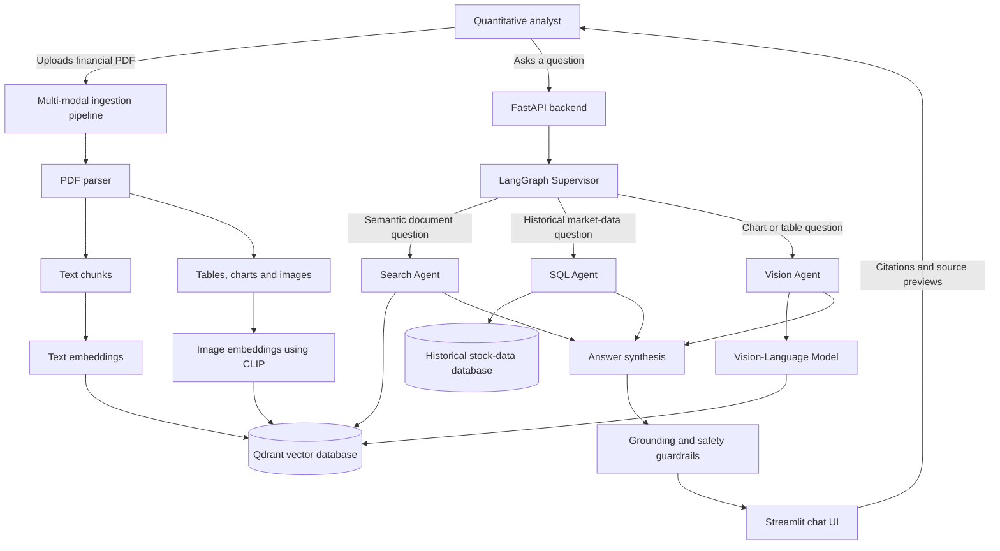

# OmniBrain System Architecture

## Purpose

OmniBrain is an agentic, multi-modal Retrieval-Augmented Generation (RAG) system for analysing long corporate financial reports. It combines document text, tables, charts, images, and historical stock data to produce a grounded, cited investment memo.

## High-Level Flow

## Components

### 1. Multi-modal ingestion pipeline

When a PDF is uploaded, the pipeline extracts page text, tables, charts, and images. Text is split into smaller chunks with page metadata. Images and charts retain their source page number so the final answer can cite the original PDF location.

### 2. Vector database

Qdrant stores two searchable collections:

- **Text collection:** text-chunk embeddings and metadata such as document name, page number, and section.
- **Image collection:** CLIP image embeddings and metadata such as document name, page number, and image description.

This lets the system retrieve both narrative text and visual evidence relevant to a question.

### 3. LangGraph supervisor

The supervisor receives the user question and decides which specialist agents are required. It may call one agent or coordinate multiple agents when a question needs evidence from different sources.

| Query type | Routed agent | Example |
| --- | --- | --- |
| Information from the uploaded report | Search Agent | “What risks did the company report?” |
| Historical market figures | SQL Agent | “Compare revenue growth with stock performance.” |
| Data inside a chart or table | Vision Agent | “What was the FY24 operating margin in the chart?” |

### 4. Specialist agents

- **Search Agent:** retrieves relevant text and image evidence from Qdrant.
- **SQL Agent:** translates permitted analytical questions into SQL against a historical stock-data database.
- **Vision Agent:** uses a Vision-Language Model to read values and trends from retrieved charts, tables, and images.

### 5. Synthesis, evaluation, and guardrails

The synthesis step combines only the retrieved agent evidence into a concise investment memo. Each material claim must include source metadata such as PDF page number, chart identifier, or database query result. Guardrails reject unsupported or out-of-scope answers, while observability records latency, tokens, routing decisions, and evaluation results.

## Reliability Features

- **Self-correction:** if retrieved evidence is irrelevant or insufficient, the agent rewrites the search query and retries before answering.
- **Citation-first responses:** claims link to their exact PDF page, chart, or data source.
- **Grounded generation:** the final response is limited to retrieved context and approved SQL results.
- **Observability:** Langfuse records traces, costs, latency, and agent execution paths for evaluation.

## Initial Technology Choices

| Area | Technology |
| --- | --- |
| Orchestration | LangGraph |
| API | FastAPI |
| User interface | Streamlit |
| Vector retrieval | Qdrant (FAISS can be used for local experiments) |
| Vision reasoning | GPT-4o or LLaVA |
| Guardrails | NeMo Guardrails |
| Observability | Langfuse |
